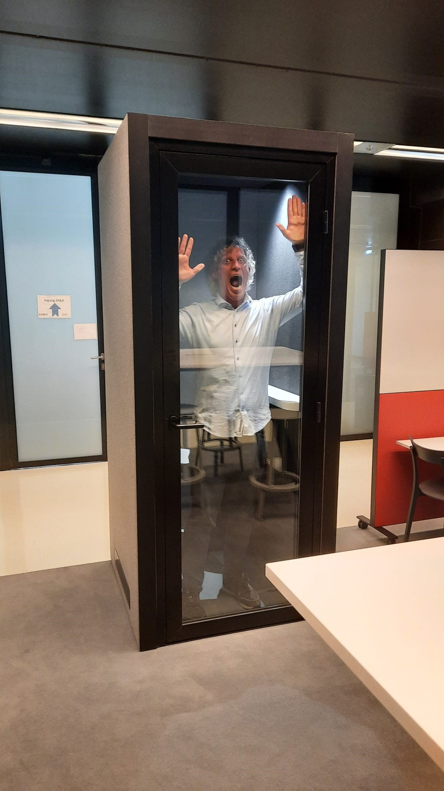

# Beste Coen... {.unnumbered}
<br>
Na een mooie loopbaan bij de UB zwaaien we je uit en wensen we je met zijn allen heel veel werkplezier en geluk bij het Rijksmuseum.

Je vertelde me een keer een heel smakelijk verhaal over je eerste ervaring met de bekende sterk ruikende [andouilleworst](https://duckduckgo.com/?q=andouille+saucisse&atb=v339-7bc&iar=images&iax=images&ia=images), die je coûte que coûte wilde opeten (ondanks de niet zo smakelijke structuur), terwijl de kok je al had gerustgesteld dat je goed bezig was en het restant echt niet hoefde op te eten. Je bent een doorzetter en een avonturier, dat blijkt wel.
Met je vrienden zoek je af en toe restaurants op waar men beweert dat er een bepaald gerecht is bedacht.
In combinatie met de reislust van jou en Petra dacht ik niet aan een kookboek – want over koken heb ik je eigenlijk nooit gehoord – maar aan iets anders.
We willen je daarom verrassen met deze culinaire reisgids vol lekkere, unieke en uitgesproken gerechten met daarbij natuurlijk de locatie waar je deze gerechten kan gaan proeven.

Hierbij nam ik in gedachten dat Petra en jij regelmatig rigoureus jullie huis opruimen. Dat gecombineerd met de open science gedachte waar je je bij de UB en bij het Rijksmuseum voor inzet, levert een open toegankelijk online document op.

We hopen dat je – samen met ons – nog jaren kan genieten van culinaire traktaties van onze reislustige collega’s.

Geniet ervan!

Kim

```{r echo=FALSE, out.width = "100%"}
knitr::include_graphics("images/as/as-team_220621_35081.jpg")
```

```{r echo=FALSE, out.width = "100%"}
knitr::include_graphics("images/as/as-team_220621_35124_L.jpg")
```

```{r echo=FALSE, fig.align = 'center'}

```
