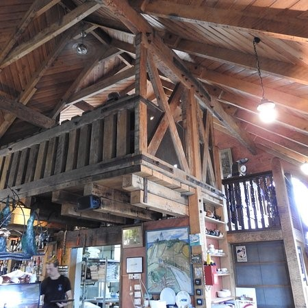
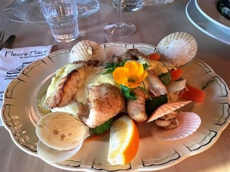
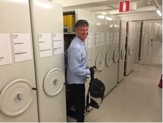
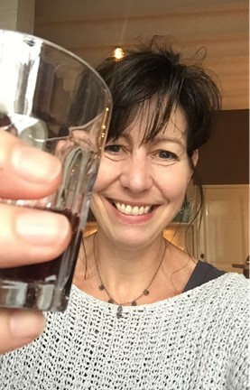
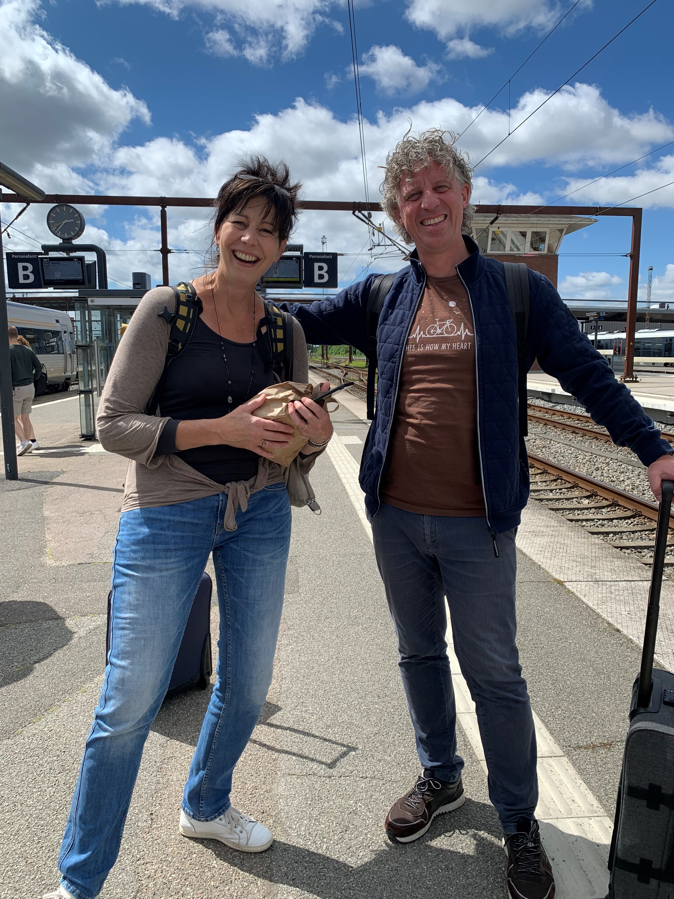

# Martine Pronk

```{r echo = FALSE, include = FALSE, message = FALSE, warning = FALSE}
library(bookdown)
library(data.table)
library(ggmap)
library(RgoogleMaps)
library(shiny)
library(leaflet)
library(tidyverse)
library(readxl)
```

```{r echo = FALSE, include = FALSE, message = FALSE, warning = FALSE}
forms <- read_excel("data/coens_culinaire_reisgids_processed_in_v4.xlsx")
```

```{r echo = FALSE, include = FALSE, message = FALSE, warning = FALSE}
forms_filtered <- filter(forms, naam == "Martine Pronk")
```

## Dit gerecht zou je echt eens moeten proberen {-} 

```{r, echo = FALSE, message = FALSE, warning = FALSE, results='asis'}
cat(forms_filtered$gerecht)
```

## Het komt uit dit land {-}

```{r, echo = FALSE, message = FALSE, warning = FALSE, results='asis'}
cat(forms_filtered$land)
```

## Waarom geef ik je deze tip {-}

```{r, echo = FALSE, message = FALSE, warning = FALSE, results='asis'}
cat(forms_filtered$tip)
```

## Horecagelegenheid {-}

```{r, echo = FALSE, message = FALSE, warning = FALSE, results='asis'}
cat(forms_filtered$horecagelegenheid)
```

## Map {-}

```{r echo = FALSE, message = FALSE, warning = FALSE, results='asis'}
cat(forms_filtered$Map_link)
```

## Fotos! {-}

```{r echo = FALSE, message = FALSE, warning = FALSE, fig.align = 'center'}
# foto_gerecht <- forms_filtered$foto_gerecht


```
```{r echo = FALSE, message = FALSE, warning = FALSE, fig.align = 'center'}
foto_gerecht <- forms_filtered$foto_gerecht


```

```{r echo = FALSE, message = FALSE, warning = FALSE, fig.align = 'center'}
# foto_gerecht <- forms_filtered$foto_gerecht


```

```{r echo = FALSE, message = FALSE, warning = FALSE, fig.align = 'center'}
# foto_persoon <- forms_filtered$foto_persoon


```


```{r echo = FALSE, message = FALSE, warning = FALSE, fig.align = 'center'}
# foto_persoon <- forms_filtered$foto_persoon


```

```{r echo = FALSE, message = FALSE, warning = FALSE, out.width = "100%", fig.align = 'center'}
# foto_persoon <- forms_filtered$foto_persoon


```
